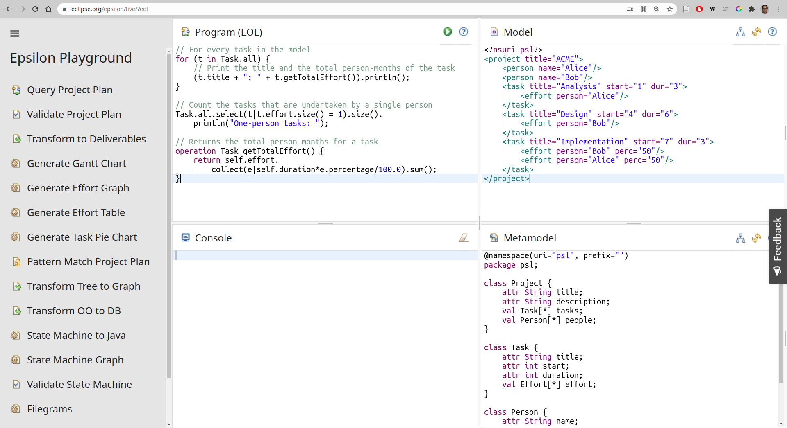
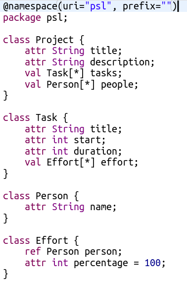
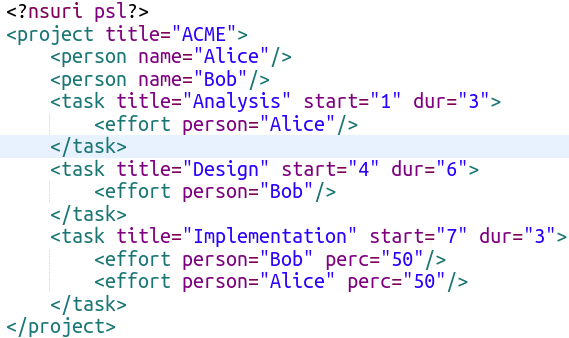

# Introduction

## Who am I?

* Lecturer in Computer Science at Aston University
* Committer in [Eclipse Epsilon](https://eclipse.org/epsilon) since 2011
* Used Epsilon for several approaches:
  * Test design and generation
  * Process-oriented website generation
  * Self-adaptive system introspection
  * Timetable optimisation and export/import

## Session outline

1. Basics: models, metamodels, etc.
1. High-level view of the Epsilon project
1. Exercises with the [Epsilon Playground](https://www.eclipse.org/epsilon/live/):
   * EOL: the base expression language
   * ETL: transform a model to another model
   * EGL: generate text from a model

## What is Model-Driven Engineering?

* In "traditional" engineering, we develop the system directly on the implementation language
* Model-driven engineering (MDE) uses instead *modeling languages* specific to the problem
* A railway engineer cares about railways: the actual implementation will come later!

<small>[This JOT blog post](http://blog.jot.fm/2013/01/25/lies-damned-lies-and-uml2java/) talks about what MDE is *not*, too!</small>

## Some basic terms in MDE (1/2) {.diagram-slide}

:::::::::::::: {.columns}

::: {.column width="30%" align=center}

<div>
<span class="diagram-data" style="display: none;">
  graph TD;
    M[Model] -->|describes| S[System];
    ML[Modeling Language] -->|used to specify| M;
</span>
<div class="diagram-display"></div>
</div>

:::
::: {.column width="70%" align=center}

- We are developing a *system* <small>(e.g. a railway control system)</small>
- The *model* describes a part of it <small>(e.g. the tracks, sensors, and actuators)</small>
- A *modeling language* is used to specify the model<br/><small>(e.g. [railML](https://www.railml.org/en/))</small>
- A *modeling language* has:
  - *Abstract syntax*: concepts
  - *Concrete syntax*: notation (graphical, textual, tabular...)

:::
::::::::::::::

## Some basic terms in MDE (2/2) {.diagram-slide}

:::::::::::::: {.columns}

::: {.column width="30%" align=center}

<div>
<span class="diagram-data" style="display: none;">
  graph TD;
    MM[Metamodel] -->|describes concepts from| ML[Modeling Language];
    MML[Metamodeling language] -->|used to specify| MM;
</span>
<div class="diagram-display"></div>
</div>

:::
::: {.column width="70%" align=center}

- To reduce the cost of making a modeling language, we often use a *metamodeling language* <small>(e.g. [Ecore from EMF](https://www.eclipse.org/modeling/emf/), or [XML Schema](https://www.w3.org/XML/Schema))</small>
- We create a *metamodel* of the concepts of the language, which drives its implementation <small>(e.g. an <code>.ecore</code> or <code>.xsd</code> file)</small>
- We use other tools (e.g. [Sirius](https://www.eclipse.org/sirius/) or [Xtext](https://www.eclipse.org/Xtext/)) to implement the concrete syntax (notation)

:::
::::::::::::::

## Some examples of modeling languages

* [Archimate](https://publications.opengroup.org/archimate-library/archimate-standards/c197): for enterprise architectures
* [BPMN](https://www.bpmn.org/): for business processes
* [Simulink](https://www.mathworks.com/products/simulink.html): for control systems
* [SysML](https://www.omg.org/spec/SysML/): for systems engineering
* [ThingML](https://github.com/TelluIoT/ThingML): for Internet-of-Things devices
* [UML](https://www.omg.org/spec/UML/): for software development

## Where does Epsilon come into play?

* A model is more than just documentation:
  * We can do early validation on the model
  * We can transform the model to another language
  * We can produce reports and code from it
* [Eclipse Epsilon](https://www.eclipse.org/epsilon/) provides a family of languages dedicated to model-to-model transformation, code generation, model validation, and other common MDE tasks

## How is Epsilon structured? {.diagram-slide}

<div>
<span class="diagram-data" style="display: none;">
graph TD
    ECL["Model&lt;br/&gt;comparison&lt;br/&gt;(ECL)"]
    Flock["Model&lt;br/&gt;migration&lt;br/&gt;(Flock)"]
    EGL["Code&lt;br/&gt;generation&lt;br/&gt;(EGL)"]
    EVL["Model&lt;br/&gt;validation&lt;br/&gt;(EVL)"]
    EPL["Pattern&lt;br/&gt;Matching&lt;br/&gt;(EPL)"]
    EML["Model&lt;br/&gt;Merging&lt;br/&gt;(EML)"]
    ETL["M2M&lt;br/&gt;Transformation&lt;br/&gt;(ETL)"]
    EOL["Epsilon Object Language (EOL)"]
    ETL --&gt; |extends|EOL
    EML --&gt; |uses for matching|ECL
    EML --&gt; |extends|ETL
    EPL --&gt; |extends|EOL
    ECL --&gt; |extends|EOL
    EGL --&gt; |preprocessed into|EOL
    EVL --&gt; |extends|EOL
    Flock --&gt; |extends|EOL
    Pinset --&gt; |extends|EOL

    EMC["Epsilon Model Connectivity (EMC)"]
    EMF["Eclipse Modeling&lt;br/&gt; Framework (EMF)"]
    Simulink["MATLAB&lt;br/&gt;Simulink"]
    Excel["Excel&lt;br/&gt;Speadsheets"]
    PTC["PTC Integrity&lt;br/&gt;Modeller"]
    Dots["..."]

    EOL --&gt;|accesses models through| EMC
    EMC --- EMF
    EMC --- Simulink
    EMC --- XML
    EMC --- Excel
    EMC --- PTC
    EMC --- CSV
    EMC --- Dots
</span>
<div class="diagram-display" style="min-height: 700px;"></div>
</div>

## How can Eclipse Epsilon be used?

* We will use the [Playground](https://www.eclipse.org/epsilon/live) to learn the basics
* The [Eclipse-based editors](https://www.eclipse.org/epsilon/download/) are best for rapid development of Epsilon scripts
* Epsilon scripts can be embedded into:
  * Your own Eclipse plugins
  * Your JVM-based programs (using plain JAR distributions from [Maven Central](https://search.maven.org/search?q=g:org.eclipse.epsilon))
  * Your [Ant](https://www.eclipse.org/epsilon/doc/workflow/)/[Maven](https://www.eclipse.org/epsilon/doc/articles/running-epsilon-ant-tasks-from-command-line/#maven)/[Gradle](https://www.eclipse.org/epsilon/doc/articles/running-epsilon-ant-tasks-from-command-line/#gradle) build processes

# Hands-on exercises: Epsilon Object Language (EOL)

## First steps

* We'll start with EOL, the base for all other Epsilon languages: it provides imperative code blocks, modularity, and expressions
* Please open the [Epsilon Playground](https://www.eclipse.org/epsilon/live){target="_blank"}
* Select the "Query Project Plan" example project

## Playground UI for sample EOL project



## Metamodel for sample EOL project

:::::::::::::: {.columns}

::: {.column width="30%" align=center}



:::
::: {.column width="70%" align=center}

* Playground uses [Emfatic](https://www.eclipse.org/emfatic/) as concrete syntax for metamodels
* Metamodel describes a task tracking domain-specific modeling language (DSML):
  * Projects have title + description, contain 0+ tasks and people
  * Tasks have title + start + duration, contain effort assignments
  * People have names
  * An effort assignment has percentage, refers to a person

:::
::::::::::::::

## Model for sample EOL project



* Playground uses "fuzzy" [Flexmi XML](https://www.eclipse.org/epsilon/doc/flexmi/) for models
* Alice and Bob work across 3 tasks (analysis, design, and implementation)

## First bit of EOL code!

* Replace the "Program" with this, and click on {style="margin: 0px;"}:

   ```js
   Task.all.first.title.println();
   ```

* `Type.all` = collection of all `Type` instances
* All collections support [a number of operations](https://www.eclipse.org/epsilon/doc/eol/#collections-and-maps): `first` returns the first element
* `println()` is one operation supported by [any value](https://www.eclipse.org/epsilon/doc/eol/#types): you can also provide a string as a prefix (e.g. `"title: "`)

## Looping with for

* A "foreach" loop in EOL is done as follows:
  ```js
  for (element in collection) {
    /* code */
  }
  ```
* Change the code to print the title of all tasks

::: notes

```js
for (t in Task.all) {
  t.title.println('title: ');
}
```

:::

## First-order operations

* Show only the tasks longer than 3 days
* Two approaches:
  * `if` inside the `for` loop (as in C / JavaScript)
  * Use `collection.select(e | condition)`
* EOL collections have other useful ["first-order operations"](https://www.eclipse.org/epsilon/doc/eol/#collections-and-maps) like `select`, replacing many loops:
  * Closures, key-value mappings, first match
  * Universal/existential quantifiers
  * Sorting by expression, etc.

::: notes

```js
for (t in Task.all.select(e | e.duration > 3)) {
  t.title.println('title: ');
}
```

:::

## Context operations

* Let's refactor the idea of "large task" to a *context operation*: place it at the end of "Program".
  ```js
  operation Task isLarge(threshold) {
    return self.duration > threshold;
  }
  ```
* Now you can do `t.isLarge(3)` if `t` is a `Task`
* It's useful to create a library of operations for your DSML, which you can reuse from any Epsilon script by using the `import` statement.

::: notes

```js
for (t in Task.all.select(e | e.isLarge(3))) {
  t.title.println('title: ');
}

operation Task isLarge(threshold) {
  return self.duration > threshold;
}
```

:::

## In-place transformations

* EOL is often used for small imperative in-place model transformations
* For instance, if we want to add a new person:
  ```js
  var p = new Person;
  p.name = "Charlie";
  Project.all.first.people.add(p);
  ```
* Try adding a "Testing" task taking 4 days before your `for` loop: it should appear in the output

::: notes

```js
var t = new Task;
t.title = "Testing";
t.duration = 4;
Project.all.first.tasks.add(t);

for (t in Task.all.select(e | e.isLarge(3))) {
  t.title.println('title: ');
}

operation Task isLarge(threshold) {
  return self.duration > threshold;
}
```

:::

# Hands-on exercises: Epsilon Transformation Language (ETL)

# Walkthrough: Epsilon Generation Language (EGL)

# Conclusion

## Thank you!

Antonio Garcia-Dominguez

a.garcia-dominguez AT aston.ac.uk

[\@antoniogado](http://twitter.com/antoniogado)